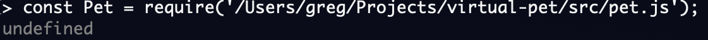
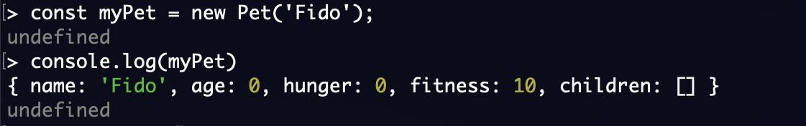
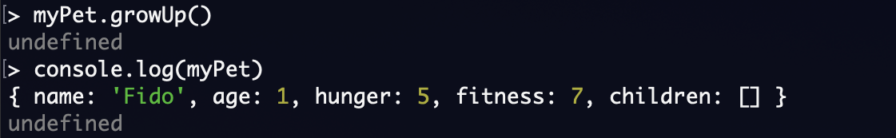
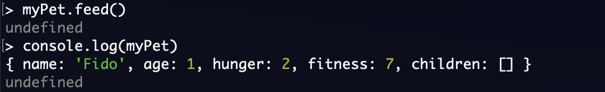
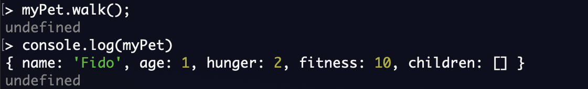
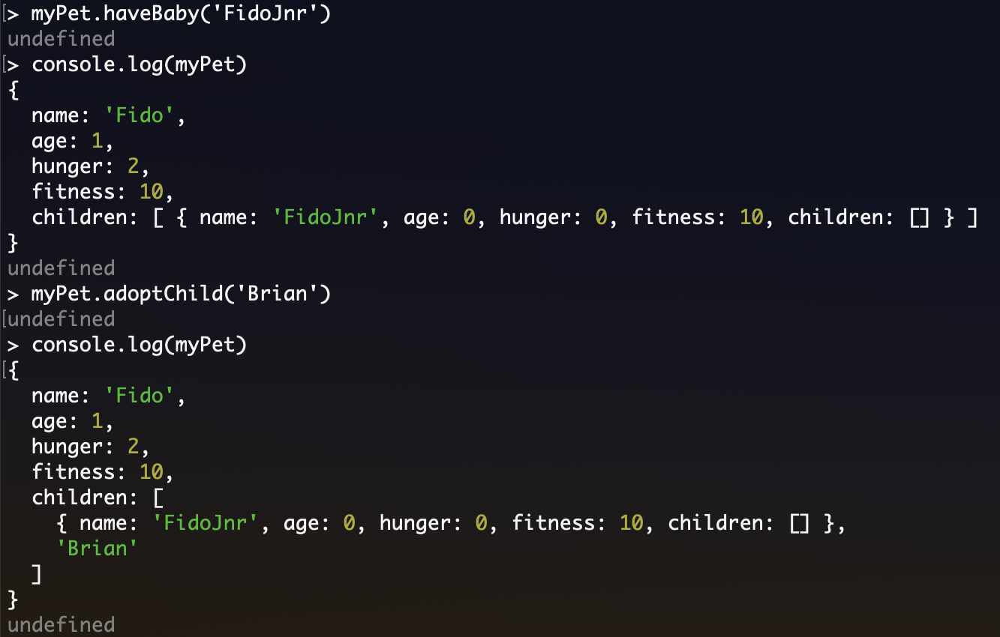

# Virtual-Pet

by Greg Cain

## Description

I'm creating this project as part of my studies with [Manchester Codes](https://www.manchestercodes.com/).

## Installation

1. Clone repo down to your machine
2. In your REPL type

   ```javascript
   const Pet = require("path/to/pet.js");
   ```

   

3. Now you can create a pet!

   yourPet is a placeholder variable, it can be whatever you want to refer your pet as in the REPL. I've used myPet in this example, but you can use anything)

   ```
   const yourPet = new Pet('putYourPetsNameHere');
   ```

   

4. You age your pet using growUp() (however it only lives to a maximum age of 30 😢)

   ```
   yourPet.growUp();
   ```

   

5. As your pet grows up you will see that not only does the pet's age change, but fitness and hunger, too! Your pet's fitness will decrease by 3, and hunger will increase by 5. If the fitness drops to 0 or hunger reaches 10 your pet will die, luckily you have tools (functions) that can help!
6. You can feed your pet with the feed function which will reduce hunger by 3

   ```
   yourPet.feed();
   ```

   

7. And you can give your pet excerise by taking it for a walk using the walk function, which will increase fitness by 3

   ```
   yourPet.walk();
   ```

   

8. You can check on how your pet is doing by using the check up function. Your pet will tell you if it needs a walk, is hungry, if it's hungry and needs or walk, or if everything is great!

   ```
   yourPet.checkUp();
   ```

   

9. Your pet can also have a baby, and also adopt a child! You will also need to look after both children by using the above functions!

   ```
   yourPet.haveBaby();
   yourPet.adoptChild();
   ```

   

## Roadmap

~~\*\*I should hopefully have this all finished by the end of week 4 of this module, which I think is Christmas Day 🙃~~~~\*\*~~

I have actually finished following the track for this project, but I still have some plans for this project!

- ~~update to object class~~
- add more properties (with aim to making pets more pokemon-like and able to fight)
- add gui

## Support

Thank you to all the support from tutors and fellow coursemates at Manchester Codes 🙌

## Authors and acknowledgement

codegregcode
